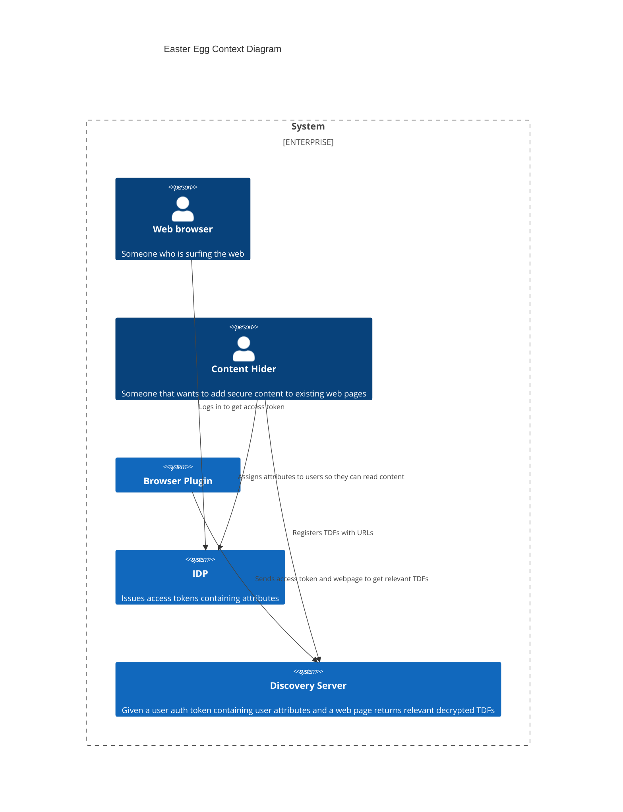

# secure-easter-egg

```mermaid
C4Context
      title Easter Egg Context Diagram
      Enterprise_Boundary(b0, "System") {
        Person(reader, "Web browser", "Someone who is surfing the web")
        Person(publisher, "Content Hider", "Someone that wants to add secure content to existing web pages")
      

        System(plugin, "Browser Plugin", "")


        System(idp, "IDP", "Issues access tokens containing attributes")
 
        System(discovery_server, "Discovery Server", "Given a user auth token containing user attributes and a web page returns relevant decrypted TDFs")


        Rel(reader, idp, "Logs in to get access token")
        Rel(publisher, idp, "Assigns attributes to users so they can read content")
        Rel(publisher, discovery_server, "Registers TDFs with URLs")
        Rel(plugin, discovery_server, "Sends access token and webpage to get relevant TDFs")
}

      
```
